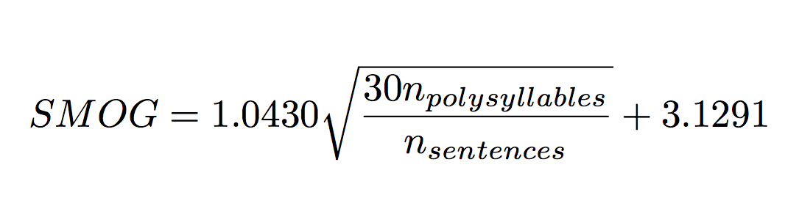

# Jason Baek 
Insight Data Engineering 18B

## Project Idea
- Making text *readability* of Project Gutenberg easily queryable 

## Purpose and Use Cases
The *readability* of a text is the text's difficulty, often expressed as a student's grade level (i.e. this student is reading at a 5th grade level). The *readability* is calculated from attributes of the text like sentence length, word length, and number of syllables. A teacher can then assign the correct difficulty of reading homework that matches the student's reading level. 

Teachers with decades of experience can select from a bank of book passages, essays, poems, and news articles that they can recall from memory. But newer teachers or parents who do not have that context will rely on the readings levels determined by childens' book publishers. This gives book publishers a lot of leverage but reading levels may vary between publishers.

For this project I will make a database where users can easily query the readability of any passage of text in Project Gutenberg, an online repository of ebooks that are no longer under copyright protection and are freely available. Nearly 57,000 books (~700 GB) are available on Project Gutenberg. Time permitting other texts such as Wikipedia or Google Books or Amazon samples can be added.  

Also, it would be interesting to see if selected words can be replaced to either increase or decrease the reading level of the passage. This would allow teachers to assign the same content to students of varying reading abilities. Newsela provides this service for news articles. 

## Computation
There are several ways to compute the readability of a text, but I will be starting with the "Simple Measure of Gobbledygook" or SMOG which is roughly the square root of the ratio between the number of multi-syllabic words and number of sentences in the text with at least 30 sentences. This means that the readability of a book can change over the course of the book. 

The SMOG scores can be compared with other readability scores that can be added later. 
- Flesch formula: average word length in syllables and average sentence length in words
- Dale-Chall: average sentence length in words and "easy" words not in specified list

## Possible queries
1. What is the readability of book X?
2. What is the readability of sentences M to N of book X?
3. What is the distribution of readability scores for book X? 
4. What are N books with a readability score between X and Y?
5. How does a book's readability vary between different scoring formulae?
6. Which words needs to be replaced to increase or decrease by X reading levels?

## Inputs
- Project Gutenberg ebooks in txt format
- Project Gutenberg ebook metadata

## Outputs
- Web app to make queries of readability database 
- Some visualizations of readability trends 

## Pipeline 
- Store raw ebook data and metadata: S3
- Data preprocessing: ? 
- Sentence segmentation and tokenizing: SparkML/spark-nlp
    - Store sentences: Postgres?
- Count number of sentences, number of syllables: Spark
    - Additional transformations and aggregations to support queries: Spark
- Store results: Postgres?
- Compute readability score: SQL/web app 
- Web app to perform searches: Flask

## Questions to Answer
- How can a book be segmented into reading passages?
- What are fast and accurate ways to segment sentences and count syllables?

## References
- https://juliasilge.com/blog/gobbledygook/
- https://www.gutenberg.org/wiki/Main_Page 
- https://en.wikipedia.org/wiki/SMOG 
- http://nlp.johnsnowlabs.com/
- https://github.com/c-w/gutenberg
