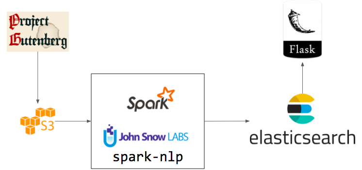

# Jason Baek 
Insight Data Engineering 18B
[Project Website](bit.ly/readassist)
[Project Slides](bit.ly/readassistslides)

## Project Idea
- Calculating *readability* scores for the ebooks of Project Gutenberg, supplementing the scores with content metadata and sentiment, and making them easily queryable 

## Purpose
The *readability* of a text is the text's difficulty, often expressed as a student's grade level (i.e. this student is reading at a 5th grade level). The *readability* is calculated from attributes of the text like sentence length, word length, and number of syllables. A teacher can then assign the correct difficulty of reading homework that matches the student's reading level.

Newer teachers or parents who do not have that context will rely on the readings levels determined by childens' book publishers. This gives book publishers a lot of leverage but reading levels may vary between publishers.

Although the readability of the text can let a teacher know if the student will understand the words in the text, but the student may not connect with the material. Even worse, the student may be turned off by it. So the readability scores will be supplemented by Project Gutenberg metadata (e.g. genre) and flagging for potentially emotionally charged material like violence or hate speech. 

Also, it would be interesting to see if selected words can be replaced to either increase or decrease the reading level of the passage. This would allow teachers to assign the same content to students of varying reading abilities. Newsela provides this service for news articles. 

## Project Description
For this project I will make a database where users can easily query the readability of any passage of text in Project Gutenberg, an online repository of ebooks that are no longer under copyright protection and are freely available. Nearly 57,000 books (~700 GB) are available on Project Gutenberg. Time permitting other texts such as Wikipedia or Google Books or Amazon samples can be added.  

### Computation
There are several ways to compute the readability of a text, but I will be starting with the "Simple Measure of Gobbledygook" or SMOG which is roughly the square root of the ratio between the number of multi-syllabic words and number of sentences in the text with at least 30 sentences. This means that the readability of a book can change over the course of the book. 

The SMOG scores can be compared with other readability scores that can be added later. 
- Flesch formula: average word length in syllables and average sentence length in words
- Dale-Chall: average sentence length in words and "easy" words not in specified list

### Possible queries
1. What is the readability of book X?
2. What is the readability of sentences M to N of book X?
3. What is the distribution of readability scores for book X? 
4. What are N <genre> books with a readability score between X and Y?
5. Which books of a readability score of X are free of potentially violent themes?
6. How does a book's readability vary between different scoring formulae?
7. Which words needs to be replaced to increase or decrease by X reading levels?

### Relevant Technologies 
- S3
    - Store raw Project Gutenberg ebook data and metadata
- Spark/spark-nlp
    - Sentence segmentation and tokenizing
    - Count number of sentences, 
	- Count number of syllables per word and sum by sentence
    - Additional transformations and aggregations to support queries
- ElasticSearch
    - Store text and scores at the sentence level
- Flask/SQL
    - Run aggregate queries for scores and texts
    - Compute readability score
    - Display trends

### Pipeline

### Engineering Challenges
- NLP libraries like nltk started as research projects and not initially designed for production environments let alone distributed processing. spark-nlp is a new library and throughput for this particular use case is not known.
- Structuring the ElasticSearch schema for these sets of queries

### The Numbers
- 56,000+ books on Project Gutenberg
- Estimating ~2MB per book, will likely supplement with another corpus such as Wikipedia
- Compare with python spacy: ~14,000 wps for syntactic parsing 
- Response time of web app: 

## References
- https://juliasilge.com/blog/gobbledygook/
- https://www.gutenberg.org/wiki/Main_Page 
- https://en.wikipedia.org/wiki/SMOG 
- http://nlp.johnsnowlabs.com/
- https://stackoverflow.com/a/33117947/758087
- https://github.com/c-w/gutenberg
- https://spacy.io/usage/facts-figures
- https://sysadmins.co.za/building-a-search-engine-for-our-scraped-data-on-elasticsearch-part-2/

